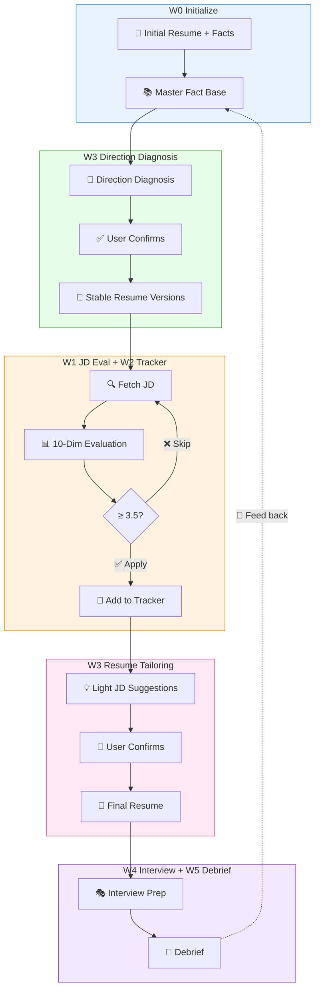

<div align="center">

[中文](README.md) · English

# 💼 Career Ops CN

#### A Codex- and GitHub Copilot-compatible skill for fetching and evaluating JDs, tracking applications, tailoring resumes, and preparing for interviews


[Why This Exists](#-why-this-exists) · [What It Does](#-what-it-does) · [Quick Start](#-quick-start) · [Workflow](#-workflow-overview)

</div>

---

## 🤔 Why This Skill

Inspired by [career-ops](https://github.com/santifer/career-ops) and adapted for **OpenAI Codex + GitHub Copilot**, with extensions for the Chinese job market:

- **Codex + Copilot compatible** — Avoids hard-coded client-only interaction tools; Codex can use supported browser control to read rendered SPA pages
- **10-dimension JD evaluation** — Scores role fit, skill coverage, growth potential, salary, WLB, etc. independently to support application decisions
- **Interview prep generation** — STAR story structuring + portable Markdown source + HTML interview handbook (company background, common questions, counter-questions)
- **Multi-user isolation** — `users/<name>/` workspaces with gitignored personal data; the Skill itself is shareable
- **Diagnostic resume tailoring** — Keep the master resume as a full fact base, recommend target directions first, generate stable direction-specific versions, then provide light JD-level suggestions that require user confirmation before writing final resumes
- **Layered JD retrieval** — Direct reads, search recovery, signed-in browser DOM, user-assisted steps, and pasted text form a progressive fallback; platform success is verified at runtime

## 📋 What It Does

| Feature | Trigger | Description |
|---------|---------|-------------|
| Evaluate JD | `Evaluate this JD: [text]` | 10-dimension scoring + overall rating + gap analysis |
| Track Jobs | `Add to tracker` | CSV-based job tracker with auto-increment ID and status management |
| Resume Direction Diagnosis | `Recommend target directions from my master resume` | Analyze the master resume and ask the user to confirm primary/transition/fallback directions |
| Generate Stable Resume Version | `Generate an AI solution resume version` | Create a stable direction-specific resume from the confirmed master fact base |
| Light JD Tailoring | `Give tailoring suggestions for #6` | Suggest keyword, ordering, and wording changes; write the final resume only after user confirmation |
| Interview Prep | `Interview prep` / `Prepare for interview` | Predict questions from JD + match existing STAR stories + generate answer frameworks |
| Interview Debrief | `Debrief` / `Review interview recording` | Audio transcription → per-question analysis → pattern recognition → feed back to master resume |
| Master Iteration | `Add experience` / `Add story` / `STAR` | Add experiences to the master fact base anytime, auto-structured as STAR |
| Acquire JD | `Fetch this link: [URL]` / attach screenshots | Layered retrieval; read screenshots directly when anti-automation blocks the page |

## 🚀 Quick Start

**1. Install the skill**

```bash
# Windows
git clone https://github.com/jackysummerfield/career-ops-cn.git "%USERPROFILE%\.agents\skills\career-ops-cn"

# macOS / Linux
git clone https://github.com/jackysummerfield/career-ops-cn.git ~/.agents/skills/career-ops-cn

# Codex (or manage it through a personal marketplace/workspace manifest)
git clone https://github.com/jackysummerfield/career-ops-cn.git ~/.codex/skills/career-ops-cn
```

**2. Initialize your workspace**

In Codex or Copilot Chat, type `Initialize job search workspace` and follow the prompts to fill in your resume.

**3. Verify**

Type `Evaluate this JD: [paste any JD]`. If you see a 10-dimension scoring table, you're all set.

> 💡 Codex should prefer its supported Browser/Chrome control. Use Playwright only as a fallback when the client has no browser-control capability. See [references/jd-fetching.md](references/jd-fetching.md).

### Optional local utilities

- `util/gen_dashboard.py` generates a portable `dashboard.md` by default and can also produce a double-clickable `dashboard.html`.
- `util/render_markdown.py` renders interview-prep Markdown as standalone HTML; both utilities use only the Python standard library.
- `util/fetch_jd.py` is an optional Playwright fallback for clients without supported browser control. See [`util/README.md`](util/README.md) for installation and safety boundaries.

## ⚙️ Workflow Overview

> 💡 The master resume is a living fact base, not a direct submission copy. Stable versions serve target directions; JD-level edits remain light and require user confirmation. Debrief feeds insights back to the master, forming a closed loop.

<details>
<summary><b>📊 Click to expand full workflow diagram</b></summary>



</details>

## � Output Examples

<details>
<summary><b>Master Resume</b></summary>

```markdown
# San Zhang | Senior Product Manager

## Contact
- Phone: 138-xxxx-xxxx | Email: zhangsan@email.com
- Location: Beijing | Expected Salary: 80-100w CNY

## Target Role
AI Product Director / AI Platform Product Lead

## Professional Summary
6 years in product, focused on AI/data platforms. Skilled at 0-to-1 builds and scaled deployment.

## Core Skills
- Product strategy & roadmap
- LLM/NLP application deployment
- Cross-functional leadership (8-person team)
- A/B experimentation systems
- Data-driven decision making

## Experience

### Senior Product Manager | ABC Tech | 2022.03 - Present
- Built AI platform product from 0 to 1, grew DAU from 0 to 50K
- Managed 8-person product team, led cross-functional collaboration
- Drove LLM deployment, launched AI CS module, reduced human escalation by 40%

### Product Manager | DEF Internet | 2019.06 - 2022.02
- Owned e-commerce search & recommendation module, lifted GMV by 15%
- Designed A/B experiment platform supporting 200+ concurrent experiments

## Education
- M.S. | XX University, Computer Science | 2017-2019
- B.S. | XX University, Software Engineering | 2013-2017

## Project Highlights / STAR Library
(See the interview stories section in cv_master.md)

## Certifications & Other
- PMP Certified
- English: Fluent (IELTS 7.5)
```

</details>

<details>
<summary><b>10-Dimension Evaluation</b></summary>

```markdown
## Evaluation: ABC Tech — AI Product Director (Beijing)

| Dimension | Score | Notes |
|-----------|-------|-------|
| Role Fit | 4.5 | Natural career progression from current role |
| Skill Coverage | 4.0 | LLM deployment experience matches well; lacks P&L ownership |
| Experience Level | 4.0 | Requires 5+ yrs, have 6 |
| Industry Fit | 3.5 | AI direction aligned, but to-B → to-C is a leap |
| Growth Potential | 4.5 | Reports to VP, team expansion planned |
| Salary Range | 4.0 | 80-120w CNY, meets expectations |
| Company Scale | 3.5 | Series B, some uncertainty |
| Location | 5.0 | Local |
| Culture Fit | 4.0 | Flat, engineering-driven |
| Competition | 3.0 | Role open 3 weeks, competitive |

**Overall: 4.05 / 5.0**

**Key Gap**: No standalone P&L responsibility
**Differentiator**: LLM deployment track record + A/B platform design
```

</details>

<details>
<summary><b>Interview Prep Material</b></summary>

```markdown
# Interview Prep: ABC Tech — AI Product Director

## Company Background
- ABC Tech, Series B, AI SaaS vertical, raised 200M CNY in 2023
- Core product: Enterprise AI platform serving finance/retail
- Team size: ~200 total, 20 in product

## Role Key Info
- Reports to: VP of Product
- Team: 5 direct reports, 8 dotted-line
- Core KPIs: AI module revenue, customer renewal rate

## STAR Stories (Matched to JD Requirements)

### Story 1: Launching LLM Customer Service (matches "AI deployment experience")
**S**: 30-person CS team, 2000+ daily tickets, high labor cost
**T**: Ship intelligent CS by Q3, reduce human escalation
**A**: Vendor evaluation → hybrid design → cross-team alignment → canary rollout
**R**: Human escalation 72%→40%, saving ~450K CNY/month

### Story 2: Building A/B Experiment Platform (matches "data-driven")
**S**: Teams running experiments without standardization, unreliable results
**T**: Build unified experiment platform
**A**: Define metrics framework → develop traffic splitting engine → establish review process
**R**: Supported 200+ concurrent experiments, decision efficiency up 60%

## Common Questions Prep
- Q: How do you drive a cross-functional project?
- Q: Describe a product decision that failed and your retrospective
- Q: How do you measure AI product ROI?

## Counter-Questions
- What are the top 3 priorities for this role in the next 6 months?
- What's the current tech debt / org debt on the team?
- What does the reporting line and decision-making process look like?
- What stage is AI module commercialization at?
```

</details>
## 🗺️ Roadmap

- [x] **Core workflows** — Master resume, JD eval, Tracker, resume tailoring, interview prep, debrief
- [x] **Portable Markdown Dashboard + optional HTML** — Standard Markdown navigation by default, with a zero-dependency HTML companion view
- [ ] **Localhost portal** — Upgrade path if static HTML proves insufficient

See [`docs/roadmap.md`](docs/roadmap.md) for details.
## �🙏 Acknowledgments

- [career-ops](https://github.com/santifer/career-ops) — Original inspiration
- [Playwright](https://playwright.dev/) — SPA fallback when supported browser control is unavailable
- [955.WLB](https://github.com/formulahendry/955.WLB) / [996.ICU](https://github.com/996icu/996.ICU) — WLB reference data
